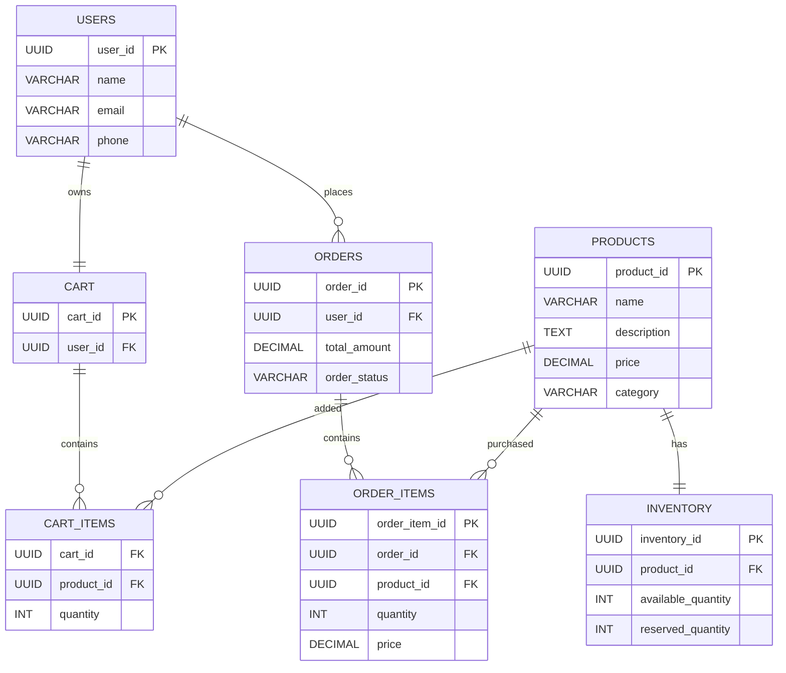

# DB Design for E-commerce

## Overview

The e-commerce platform is designed to support millions of users, products, and orders while ensuring high availability, scalability, and data consistency. Since the system contains highly structured data with multiple relationships and requires ACID transactions for order processing and payments, a relational database such as PostgreSQL is chosen.

The primary entities are Users, Products, Orders, Cart, Inventory, and Order Items. The schema is normalized to reduce redundancy while selectively denormalizing a few fields to optimize read performance.

---

# Core Entities

## Users

Stores customer information.

| Column | Description |
|---------|-------------|
| user_id (PK) | Unique user identifier |
| name | Customer name |
| email | Unique email address |
| phone | Contact number |
| created_at | Registration timestamp |

---

## Products

Stores all products available for purchase.

| Column | Description |
|---------|-------------|
| product_id (PK) | Product identifier |
| name | Product name |
| description | Product description |
| category | Product category |
| price | Current selling price |
| created_at | Product creation timestamp |

---

## Inventory

Tracks stock availability.

| Column | Description |
|---------|-------------|
| inventory_id (PK) | Inventory identifier |
| product_id (FK) | Product reference |
| warehouse_id | Warehouse location |
| available_quantity | Available stock |
| reserved_quantity | Reserved stock |

Inventory is maintained separately because stock levels change frequently while product details change infrequently.

---

## Cart

Represents a user's shopping cart.

| Column | Description |
|---------|-------------|
| cart_id (PK) | Cart identifier |
| user_id (FK) | Cart owner |
| created_at | Creation timestamp |

---

## Cart Items

Stores products added to a cart.

| Column | Description |
|---------|-------------|
| cart_id (FK) | Cart reference |
| product_id (FK) | Product reference |
| quantity | Selected quantity |

A cart can contain multiple products, and a product can appear in many carts.

---

## Orders

Stores completed purchases.

| Column | Description |
|---------|-------------|
| order_id (PK) | Order identifier |
| user_id (FK) | Customer |
| order_status | Pending, Shipped, Delivered |
| total_amount | Total order value |
| created_at | Order timestamp |

---

## Order Items

Stores products purchased in an order.

| Column | Description |
|---------|-------------|
| order_item_id (PK) | Unique item |
| order_id (FK) | Order reference |
| product_id (FK) | Product purchased |
| quantity | Purchased quantity |
| price | Price at purchase time |

The product price is stored separately because product prices may change after the order is placed.

---

# Relationships

- One User can have one active Cart.
- One User can place many Orders.
- One Cart contains multiple Cart Items.
- One Order contains multiple Order Items.
- One Product can appear in multiple Cart Items.
- One Product can appear in multiple Order Items.
- One Product has one Inventory record per warehouse.

---

# ER Diagram

---

# Indexing Strategy

To improve query performance, the following indexes are created.

### Users

- Primary Key on `user_id`
- Unique Index on `email`

Reason:
Authentication and profile lookup are frequent operations.

---

### Products

- Primary Key on `product_id`
- Index on `category`
- Index on `price`

Reason:
Product search and filtering are common.

---

### Inventory

- Index on `product_id`

Reason:
Inventory lookup occurs during checkout.

---

### Orders

- Index on `user_id`
- Index on `created_at`
- Composite Index `(user_id, created_at DESC)`

Reason:
Users frequently view recent orders.

---

### Order Items

- Index on `order_id`
- Index on `product_id`

Reason:
Fast retrieval of products within an order.

---

### Cart Items

- Composite Index `(cart_id, product_id)`

Reason:
Quick retrieval and updates while users modify their carts.

---

# Denormalization Decision

The schema is largely normalized to maintain data integrity. However, one intentional denormalization is storing the product price inside the `Order Items` table.

Without denormalization:

- Order Item references Product.
- Current product price is fetched from the Products table.

Problem:

If the product price changes after an order is placed, historical orders would display incorrect prices.

Instead, the price at the time of purchase is copied into the Order Items table.

Example:

Product

| Product | Current Price |
|----------|--------------|
| iPhone | ₹85,000 |

Customer purchases the product for ₹80,000 during a sale.

A month later, the price changes to ₹85,000.

If only the Product table stores the price, historical orders incorrectly display ₹85,000.

By storing the purchase price inside Order Items, historical orders always reflect the actual transaction amount.

Benefits:

- Accurate order history.
- Faster order retrieval without joining the Products table.
- Simpler invoice generation.

Trade-off:

- Slight data duplication.
- Product price updates do not affect historical records.

This trade-off is acceptable because order history should remain immutable after purchase.

---

# Conclusion

The proposed database design follows normalization principles while selectively applying denormalization where it improves performance and preserves historical accuracy. Primary and secondary indexes are added to optimize the most common queries such as product search, order history retrieval, inventory checks, and cart operations. PostgreSQL provides strong consistency, ACID transactions, and efficient indexing, making it well suited for an e-commerce platform where correctness and reliability are critical.